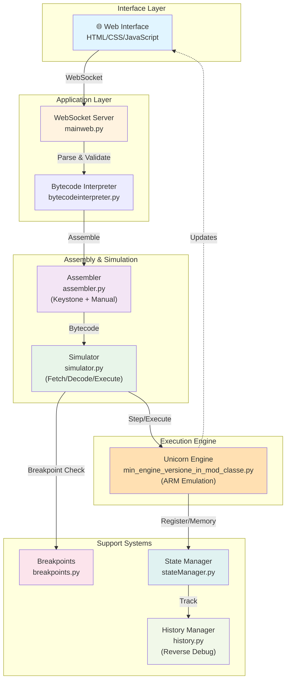
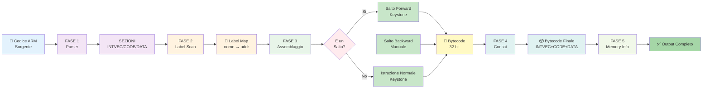

# ARMulator-Unicorn Engine
## Advanced ARM Emulator with Unicorn JIT Compilation

**University of Rome Tor Vergata**  
**BSc in Computer Science | Computer Architecture (A.Y. 2024/2025)**  
**Prof. A. Simonetta, Eng. E. Iannaccone**  
**Authors:** Serena Stefani, Beatrice Principali, Angelo De Felice

---

## 1. Introduction
## THIS IS AN ALTERNATIVE VERSION OF : https://github.com/ByteBea/ARMulator-Unicorn-v1. For further info, click this link.

**ARMulator-Unicorn** is a modern ARM emulator built on top of [Unicorn Engine](https://www.unicorn-engine.org/), replacing the legacy pure-Python interpreter with a high-performance JIT compilation backend. It provides an integrated development environment for ARM assembly education, featuring code assembly, execution, debugging, and state visualization.

### 1.1 Project Overview

The original ARMulator (based on Epater) used a Python interpreter that decoded and simulated each ARM instruction sequentially. This approach was slow and limited to ARMv4.

**ARMulator-Unicorn modernizes this by:**

- **Unicorn Engine**: JIT-compiles ARM bytecode to native machine code, achieving 10-100x speedup
- **Keystone Engine**: Professional ARM assembler supporting most of ARM7 instructions
- **Multi-platform Support**: Windows, Linux, and macOS
- **Advanced Debugging**: Breakpoints, reverse debugging, instruction history

**Execution Flow:**
```
ARM Source Code
    ↓
assembler.py (Keystone Engine)
    ↓
ARM Bytecode (32-bit instructions)
    ↓
min_engine_versione_in_mod_classe.py (Unicorn Wrapper)
    ↓
Unicorn JIT Compiler
    ↓
Native CPU Execution (x86/ARM)
```

### 1.2 Why Unicorn?

| Aspect | Pure Python | Unicorn Engine |
|--------|------------|----------------|
| **Execution Speed** | 1x (baseline) | 10-100x faster |
| **Architecture** | ARMv4 only | ARMv4 + ARMv7 |
| **JIT Compilation** |  No |  Yes (QEMU-based) |
| **Code Decoding** | Manual bit manipulation | Automatic |
| **Performance Profiling** | Difficult | Native cycles |


### 1.3 Supported ARM Architectures

- **ARMv4** (legacy, via Python simulators)
- **ARMv7** (full support via Unicorn + Keystone)
  - Data Processing: MOV, ADD, SUB, AND, ORR, EOR, BIC
  - Shifts: LSL, LSR, ASR, ROR
  - Multiply: MUL, MLA, UMULL
  - Memory: LDR, STR, LDRH, STRH, LDRB, STRB
  - Branches: B, BL, BEQ, BNE, BGT, BLE, BX
  - Multiple: LDM, STM
  - Floating Point: VFP (enabled via FPEXC)
  -other like clz ecc

### 1.4 Key Improvements

| Feature | Original | ARMulator-Unicorn |
|---------|----------|------------------|
| **Execution Engine** | `simulator.py` (Python) | Unicorn (JIT) |
| **Assembler** | Legacy yacc-based | **Keystone Engine** |
| **PC Management** | Manual updates | Unicorn automatic |
| **Instruction Decode** | Python bit-mask | Unicorn internal |
| **Breakpoint Hooks** | Python logic | Unicorn hooks (UC_HOOK_CODE) |
| **macOS Support** | Broken |  Full support |
| **ARMv7 Coverage** | None | mostly supported |
| **Performance** | Slow | **faster** |

---

## 2. Architecture

### 2.1 Project Structure

```
ARMulator-Unicorn/
├── assembler.py                          # Keystone-based ARM assembler
│                                          # - PHASE 1: Parse & Section
│                                          # - PHASE 2: Label scan & address calc
│                                          # - PHASE 3: Hybrid assembly
│                                          #   (Forward salts→Keystone, Backward→Manual)
│                                          # - PHASE 4: Bytecode concatenation
│                                          # - PHASE 5: Memory info generation
│
├── min_egine_versione_in_mod_classe.py   #  NEW: Unicorn Engine wrapper
│                                          # - Memory mapping (INTVEC/CODE/DATA)
│                                          # - Hook setup (UC_HOOK_CODE, UC_HOOK_MEM)
│                                          # - step() execution
│                                          # - Register sync (whit componets)
│                                          # - VFP/FP support via FPEXC
│
├── simulator.py                          # Orchestrator (Fetch/Decode/Execute)
│                                          # - Delegates execution to Unicorn
│                                          # - Manages breakpoints & history
│                                          # - Capstone fallback for unknown instructions
│
├── bytecodeinterpreter.py               # Middleware layer for ui
│                                          # - UI logic & WebSocket handling
│                                          # - Breakpoint management
│                                          # - State synchronization
│
├── mainweb.py                            # Bottle HTTP server + WebSocket
│                                          # - Web UI server
│                                          # - Real-time register/memory updates
│
├── main.py                               # CLI entry point
│                                          # - Command-line execution
│                                          # - Direct simulator control
│
├── history.py                            # Reverse debugging support
│                                          # - State snapshots per instruction
│                                          # - Backward step (◀ button)
│
├── simulatorOps/                         # ARMv4 instruction set (legacy)
│                                          # - BranchOp, DataOp, MemOp, etc.
│                                          # - Fallback when Unicorn in V1 of the projet
│
├── samples/                              # Example ARM assembly files
│                                          # - testfinale.asm (25 core tests)
│                                        
│                                          # - Other examples
│
├── tests/                                # Varius test
│                                          # - test_assembler.py
│                                          # - test_emulator.py
│                                          # - teststep.py (state sync validation)
│
├── interface/                            # Web Frontend
│                                          # - simulator.html
│                                          # - static/css/ (styling)
│                                          # - static/js/ (Ace editor, WebSocket)
│
├── settings.py                           # Global configuration
│                                          # - PCbehavior (PC+8 for ARM)
│                                          # - Memory addresses
│                                          # - Debug flags
│
├── stateManager.py                       # Register & memory state
│
├── components.py                         # Hardware components (Registers, Flags, Memory)
│
├── requirements.txt                      # Python dependencies
│                                          # - unicorn
│                                          # - keystone-engine
│                                          # - capstone
│                                          # - bottle
│                                          # - pywebview
│
└── README.md                             # This file

```

### 2.2 Memory Layout

```
0x0000 ┌──────────────────────┐
       │   INTVEC (128 B)     │  Interrupt Vector Table
       │   (0x00 - 0x7F)      │
0x0080 ├──────────────────────┤
       │   CODE (~4 KB)       │  Executable instructions
       │   (0x80 - 0x0FFF)    │
0x1000 ├──────────────────────┤
       │   DATA (~60 KB)      │  Static data & variables
       │   (0x1000 - 0xFFFF)  │
0x10000└──────────────────────┘
       Total: 64 KB contiguous
```

**Mapping in Unicorn:**
```python
mu.mem_map(0x0000, 0x10000)  # Single 64KB block
mu.mem_write(0x0000, intvec_bytecode)
mu.mem_write(0x0080, code_bytecode)
mu.mem_write(0x1000, data_bytecode)
```

### 2.3 Execution 

```
Input: ARM Assembly Source Code
  ↓
[ASSEMBLER.PY]
  ├─ PHASE 1: Parse & section organization
  ├─ PHASE 2: Label address calculation
  ├─ PHASE 3: Hybrid assembly
  │   ├─ Forward branches → Keystone
  │   ├─ Backward branches → Manual assembly
  │   └─ Other instructions → Keystone
  ├─ PHASE 4: Bytecode concatenation
  └─ PHASE 5: Memory info generation
  ↓
Bytecode + Label Map
  ↓
[MIN_ENGINE_VERSIONE_IN_MOD_CLASSE.PY]
  ├─ Memory allocation (64KB)
  ├─ Bytecode loading
  ├─ Hook setup
  └─ Register initialization
  ↓
[SIMULATOR.PY] ← Orchestrator
  ├─ Loop: step() × N
  ├─ PC++
  ├─ Check breakpoints
  └─ Sync state
  ↓
[UNICORN ENGINE]
  ├─ Fetch instruction
  ├─ Decode
  ├─ Execute (native CPU)
  └─ Fire hooks
  ↓
[HISTORY.PY]
  └─ Save state snapshot
  ↓
Output: Final Register State + Memory
```

---

## 3. Installation & Setup

### 3.1 System Requirements

- **OS:** Windows 10+, Linux (any distro), macOS 10.13+
- **Python:** 3.8 - 3.13
- **Memory:** 512 MB minimum
- **Disk:** 500 MB (including dependencies)

### Installation & Requirements   

### 3.1 System Requirements
- Windows 11 or any Linux distribution
- Python from `3.7` to `3.13` (for Developers)

#### Developer Installation
```plaintext
git clone https://github.com/USERNAME/REPO_NAME
pip install -r requirements.txt
```


## 4. Usage
1. Download the .zip file from project repository in GitHub.

2. Open it.

3. Create Virtual Environment `venv`:
- **Linux / macOS**

```Plaintext
python3 -m venv env_name
source nome_env/bin/activate
```
- **Windows**

```Plaintext
python -m venv env_name
nome_env\Scripts\activate
```

4. Install all the *requirements*:

```Plaintext
pip install -r requirements.txt
```

5. Use this command from the terminal to start the emulator and open the GUI:
- **Linux / MacOS**
```Plaintext
python3 mainweb.py
```
- **Windows**
```Plaintext
python mainweb.py
```


Then:
1. Write or paste ARM assembly code
2. Click **Run** or **Step**
3. View registers, memory, and history in real-time
   the lable for branch work in this way name:
   example
   main: or loop:
**Output:**
vfp enabled

## 5. How It Works: Detailed Flow

### 5.1 Assembler step

The assembler (`assembler.py`) uses **Keystone Engine** and work in 5 phase 

```
PHASE 1: Parse
  Input:  Raw ARM assembly source
  Output: Organized by sections (INTVEC, CODE, DATA)
  
PHASE 2: Label Scan
  Input:  Organized code
  Output: Label → Address map
  
PHASE 3: Assembly (Hybrid)
  Input:  Instructions + Label map
  Logic:
    if instr is BRANCH:
      if target_addr < current_addr:
        → Assemble manually (backward jump fix)
      else:
        → Use Keystone (forward jump)
    else:
      → Use Keystone
  Output: 32-bit bytecode per instruction
  
PHASE 4: Concatenation
  Input:  Bytecode per section
  Output: INTVEC_bytecode || CODE_bytecode || DATA_bytecode
  
PHASE 5: Memory Info
  Input:  Final bytecode
  Output: Start/end addresses per section
```

**Why Manual Backward Branches?**

Keystone on Windows has a known bug with backward relative jumps. The fix:
```python
# Manual assembly for backward branches
offset = (target_addr - current_addr - 8) // 4
bytecode = (0xE << 28) | (opcode << 25) | (offset & 0xFFFFFF)
```

### 5.2 Execution via Unicorn

Once bytecode is generated:

```python
# Initialize Unicorn
mu = Uc(UC_ARCH_ARM, UC_MODE_ARM)
mu.mem_map(0x0000, 0x10000)  # 64KB memory
mu.mem_write(0x0080, code_bytecode)

# Set up hooks for debugging
mu.hook_add(UC_HOOK_CODE, on_instruction_execute)
mu.hook_add(UC_HOOK_MEM_READ, on_memory_read)

# Execute one instruction at a time
while PC < program_end:
    mu.emu_start(PC, PC+4)  # Execute 1 instruction
    PC = mu.reg_read(UC_ARM_REG_PC)
```

### 5.3 Breakpoint System

Breakpoints are managed via Unicorn hooks:

```python
def on_instruction_execute(uc, address, size, user_data):
    if address in breakpoints:
        print(f" Breakpoint hit at 0x{address:04X}")
        return False  # Stop execution
```
### 5.4 GRAPH
## GENERAL

## ASSEMBLAR



## 6. Future Developments
1. Add Thumb mode support.
2. Add coprocessor instruction support (CDP, MRC, MCR) leveraging Unicorn's built-in ARM coprocessor emulation. 
3. Further optimize GUI updates and prevent passive behavior (currently uses jQuery code to react to WebSocket messages).
4. Translate the manuale or produce a new one.
5. Fix shallow copy bug in Memory.initdata to ensure correct state restoration on reset.
6. Create a standalone executable (.exe / binary) using PyInstaller to simplify distribution and avoid manual dependency installation.
7. Refactor the Code Export feature (mainweb.py / GUI).
8. Fixing the explain() part on GUI for new arm istrucion and make visible on the gui the new register 


## 7. License & Acknowledgements

This project is developed as a final assignment for the Computer Science degree program at **University of Rome Tor Vergata** by Angelo De Felice ,Serena Stefani,Beatrice Principali.

**Based on:**
- [ARMulator](https://github.com/Filippo2903/ARMulator) by Filippo Gentili, Thomas Infascelli, Matteo Sorvillo, Alessandro Stella
- [Epater](https://github.com/mgard/epater) by Marc-André Gardner, Yannick Hold-Geoffroy, Jean-François Lalonde

**External Libraries:**
- [Unicorn Engine](https://www.unicorn-engine.org/) - CPU emulation
- [Keystone Engine](https://www.keystone-engine.org/) - ARM assembler
- [Capstone Engine](https://www.capstone-engine.org/) - Disassembler
- [Bottle Framework](https://bottlepy.org/) - Web server
- [PyWebView](https://pywebview.flowrl.com/) - Desktop GUI

-
